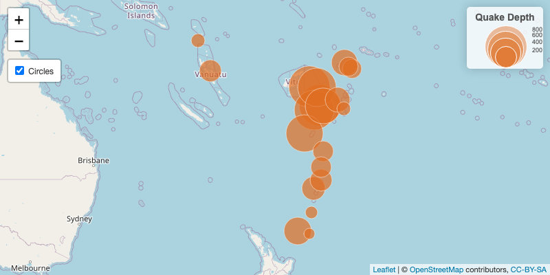

<!-- README.md is generated from README.Rmd. Please edit that file -->

# leafcirclelegend

<!-- badges: start -->

[](https://lifecycle.r-lib.org/articles/stages.html#experimental)
<!-- badges: end -->

Add scaled circle legends to leaflet maps.

## Installation

You can install the development version of `leafcirclelegend` using the
`remotes` package\`:

``` r
remotes::install_github("epicentre-msf/leafcirclelegend")
```

## Example

#### Setup

``` r
library(tidyverse)
library(leaflet)
library(leafcirclelegend)

data("quakes")

# take a sample of the data for example purposes
df_leaf <- slice_sample(quakes, n = 20) %>% arrange(desc(depth))

# make a scaling function to convert real numbers to radii appropriate for leaflet
calc_radius <- function(n, scale_factor = 30) {
  sqrt(n) / sqrt(max(n)) * scale_factor
}

# define stroke and fill params
stroke_color <- "#FFFFFF"
stroke_weight <- 1
fill_color <- "#e06e22"
fill_opacity <- 0.7
```

#### Map

``` r
leaflet(df_leaf) %>% 
  addTiles() %>% 
  addLayersControl(
    overlayGroups = "Circles", 
    position = "topleft",
    options = layersControlOptions(collapsed = FALSE)
  ) %>% 
  addCircleMarkers(
    lng = ~long, 
    lat = ~lat, 
    radius = ~calc_radius(depth),
    label = ~depth,
    fillColor = fill_color, 
    fillOpacity = fill_opacity, 
    weight = stroke_weight, 
    color = stroke_color,
    group = "Circles"
  ) %>% 
  addCircleLegend(
    title = "Quake Depth",
    values = ~depth,
    scaling_fn = calc_radius,
    fillColor = fill_color, 
    fillOpacity = fill_opacity, 
    weight = stroke_weight, 
    color = stroke_color,
    position = "topright",
    group = "Circles"
  )
```



## Related Projects

The [`leaflegend`](https://github.com/tomroh/leaflegend) package
provides many additional legend options for leaflet maps, but does not
have a scaled circle option in the style of this package. Some code,
most notably the javascript code to add the legend to a group that can
be controlled by a layer control, was taken from `leaflegend`.
